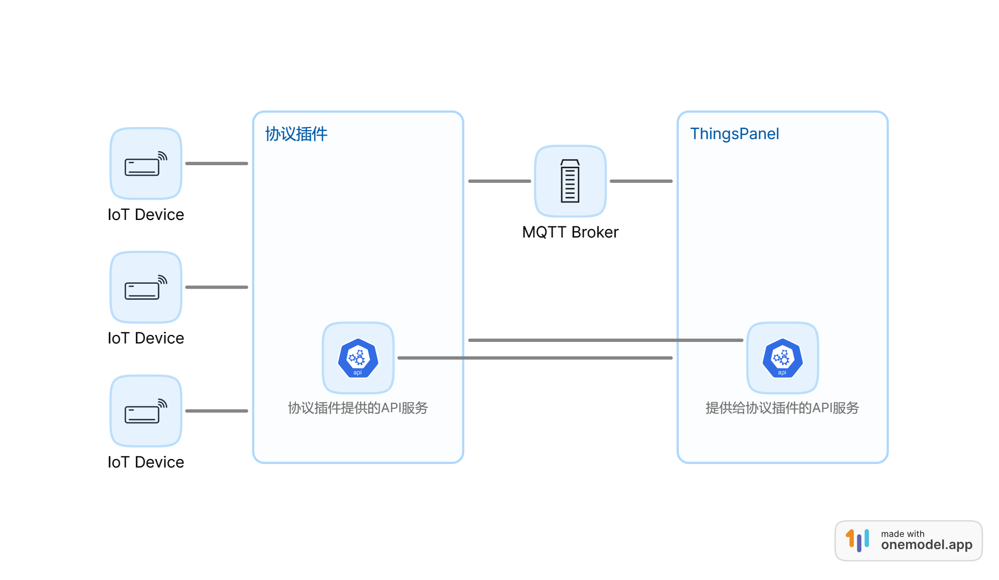
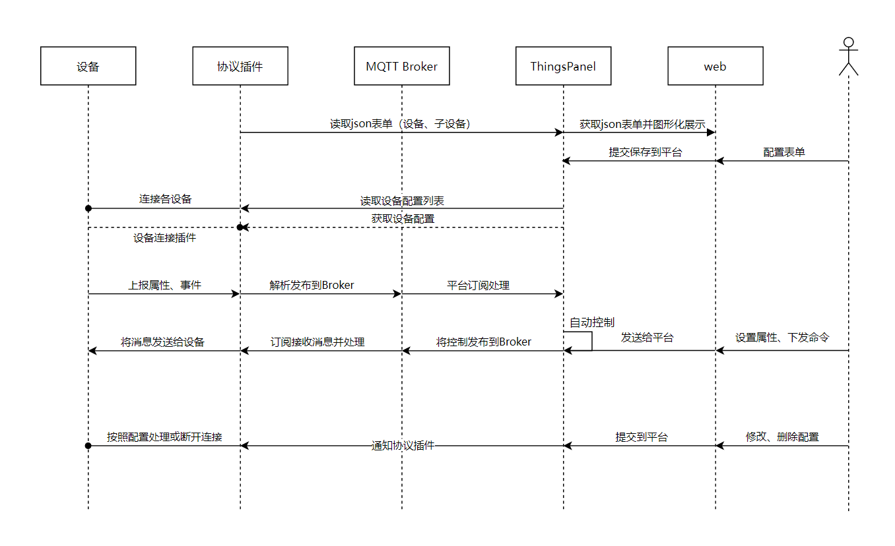

# http-procotol-plugin

## 功能和部署

- 在服务器上使用git命令获取仓库源码

  ```bash
  git clone https://github.com/ThingsPanel/http-protocol-plugin.git
  ```

- http协议插件需要单独部署，如果与Mqtt Broker和ThingsPanel后端在一个服务器（同一个网络），则不需要修改配置文件；否则修改./config.ymal的mqtt服务端地址、ThingsPanel的Address。
- 如果使用了TimescaleDB以外的时序数据库，需要修改配置文件中的db_type为other(默认是timescaledb)。
- 安装go环境（1.18版本）后，执行命令启动HTTP协议插件服务(可选择pm2进行托管)

  ```bash
  go run .
  ```

- 确保9988端口可被设备访问到

## 插件如何注册到平台

手动注册

- 使用super@super.cn用户登录平台后，点击 `应用管理`->`接入协议`->`注册插件`
- 填入插件信息

  |名称|示例|说明|
  |-|-|-|  
  |**名称**|HTTP协议|创建设备时，会显示在选择协议下拉框中  
  |**设备类型**|设备|必填，选直连设备  
  |**协议类型**|HTTP|必填，标志http协议
  |**接入地址**|dev.thingspanel.cn:9988|插件服务的ip地址和端口，在设备对接中作为平台中的提示信息
  |**HTTP服务地址**|1270.0.1:9988|插件服务的ip地址和端口（必填，供平台后端调用）
  |**插件订阅主题前缀**|plugin/http/ |必填

- 注册成功后便可创建设备，选择HTTP协议

## 设备上报数据

- 设备上报数据

  ```txt
  http请求，POST方法，RUL示例：
  http://dev.thingspanel.cn:9988/api/device/b2d162c4-bfcf-1830-d00d-ecc1897a9511/attributes
  b2d162c4-bfcf-1830-d00d-ecc1897a9511为AccessToken
  请求body示例（json）:
  {
    "temp": 18.5,
    "hum": 40,  
  }
  ```

## 协议插件开发相关

以下内容为协议插件开发相关，使用协议插件不需要了解

### 结构图





### 插件表单

`./form_config.json` （表单规则详情请参考modbus-protocol-plugin案例） ThingsPanel前端通过 `/api/form/config`接口获取表单配置，生成子设备的表单，用户填写的表单数据会出现在ThingsPanel提供的 `/api/plugin/device/config`接口返回的数据中。

### 交换数据相关

设备post发送json数据至插件

api/device/AccessToken/attributes

（api前面需链接为http协议插件所部署地址，例如http://127.0.0.1:9988/api/device/AccessToken/attributes;AccessToken为在ThingsPanel平台，添加设备绑定插件时获得的，或自定义的值）

转发至mqtt的device/attributes 主题

json数据格式：

```
{
    "temp": 18.5,
    "low": 40,
    ...
}
```

响应体：

```
{
  "code": 200,//200：成功，404：失败
  "ts": //时间戳 微秒
}
```

插件发送数据至ThingsPanel平台

1.直连设备

mqtt用户：root （使用thingspanel-go配置文件中的用户名和密码）

发布主题：device/attributes

报文规范：{"token":device_token,"values":{key:value...}}

或自定义报文：{"token":device_token,"values":自定义报文}

token：设备AccessToken或子设备AccessToken

2.在线离线通知

mqtt用户：root （使用thingspanel-go配置文件中的用户名和密码）

发布主题：device/status

报文规范：{"accessToken":accessToken,"values":{"status":status}}

accessToken:设备或网关连接时送来的密钥

status: "0"-离线 "1"-上线

或自定义报文：自定义报文
